# 🔓 Password Cracking with JTR & Networkwalks Tools

**Student:** Muhammad Muhsin Khamis  
**Program:** Cybersecurity  
**Platform:** NetworkWalks  
**Batch:** B083C  
**Week:** 03  
**Projects:** W3-PM1 (Password Cracking with JTR) & W3-PM2 (Password Cracking with NW Tools)  
**Tutor:** Waqas Karim, CCIE

---

## 📌 Project Overview

This project demonstrates two different approaches to **password cracking** on password-protected PDF files.

The first uses **John the Ripper (JTR)** — the classic offline password cracker — installed on Windows with the Johnny GUI, and then run on Kali Linux when the GUI encountered an issue.

The second uses the **Networkwalks online tools** — the Hash Calculator and Password Cracker — which run entirely in a browser and perform dictionary attacks against extracted hashes.

Both methods follow the same fundamental workflow:
1. Extract the `$pdf$` crackable hash from a locked PDF.
2. Run a dictionary attack against the hash.
3. Recover the plaintext password.
4. Use the password to unlock the PDF.

---

## 🎯 Objectives

- Understand how passwords are stored inside locked PDF files as hashes.
- Extract a `$pdf$` hash from a protected PDF.
- Install and use John the Ripper (Johnny GUI + Kali CLI).
- Use the Networkwalks Hash Calculator and Password Cracker.
- Compare offline CLI cracking vs browser-based dictionary attacks.
- Document the full cracking workflow, including a troubleshooting case.

---

## 🛠️ Tools Used

| Tool | Purpose |
|---|---|
| Kali Linux | Offline password cracking with John the Ripper |
| John the Ripper (JTR) | Password cracking tool for hashes and protected files |
| Johnny GUI | Graphical front-end for John the Ripper (Windows) |
| OnlineHashCrack | Online PDF hash extractor (`pdf2john`) |
| Networkwalks Hash Calculator | Browser-based `$pdf$` hash extractor |
| Networkwalks Password Cracker | Browser-based dictionary attack tool |
| Windows 11 | Host OS for Johnny GUI and browser-based tools |

---

## 🧩 Locked Lab Files

Three password-protected PDFs were provided for this lab:

| File | Size |
|---|---|
| `My Locked PDF1.pdf` |
| `My-Locked-PDF2.pdf` | 
| `My-Locked-PDF3.pdf` | 

They are stored in the `week3/` folder of this repository.

The extracted `$pdf$` hash used by John the Ripper is stored as `week3/hash1.txt`.

---

## 🪜 Activities Performed

### Module 1 — Password Cracking with Networkwalks Tools (W3-PM2)

#### Step 1 — Extract the hash

Uploaded the locked PDF to the **Networkwalks Hash Calculator**. The tool detected that the PDF was encrypted and extracted a crackable hash in `pdf2john` / haschat format.

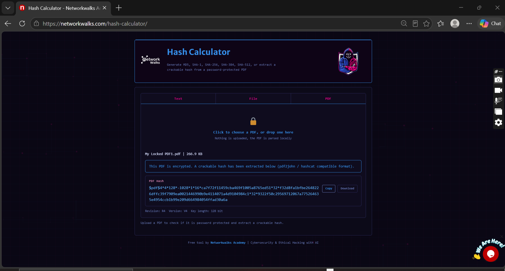

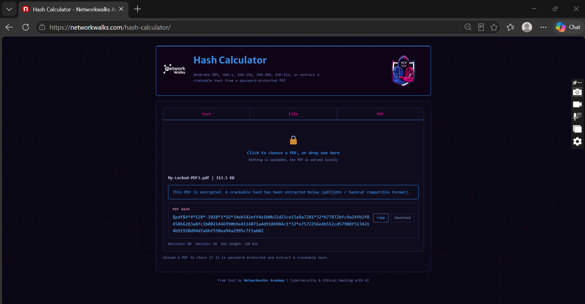

#### Step 2 — Run the dictionary attack

Pasted the extracted `$pdf$` hash into the **Networkwalks Password Cracker** and ran the built-in dictionary attack.

**Result for PDF1 — password cracked: `good-luck`**

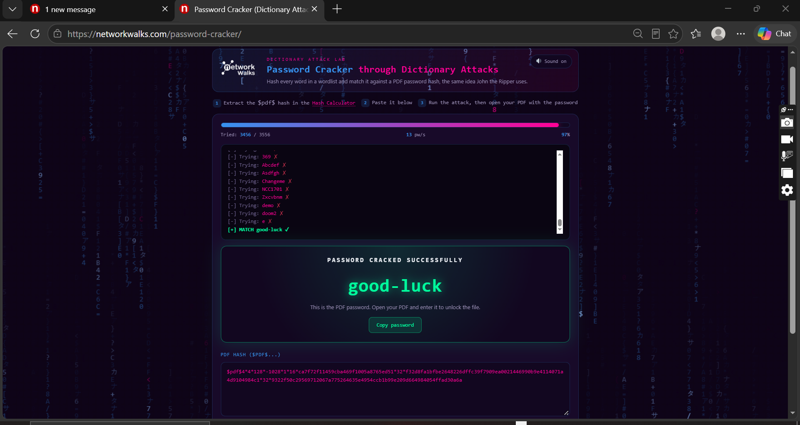

**A second run returned `password1`**

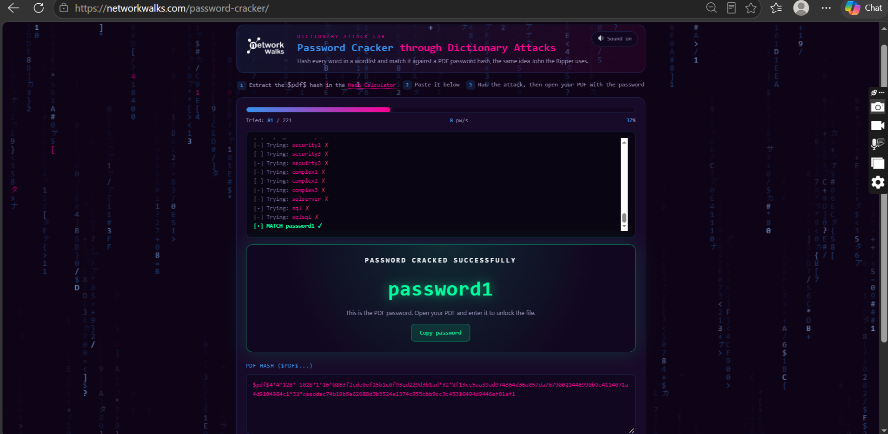

**Result for PDF3 — password cracked: `1qaz2wsx`**

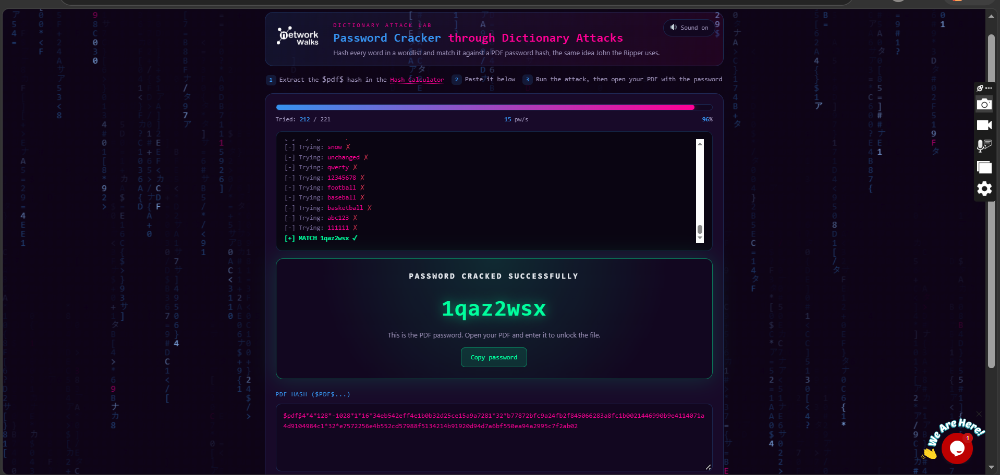

#### Step 3 — Unlock the PDF

Used the cracked password `password1` to unlock the PDF.

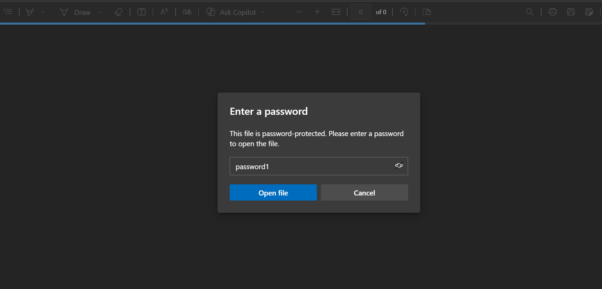

#### Results — Flags Captured

**Flag 1 (PDF1 — `good-luck`):**

**Flag 2 (PDF3 — `1qaz2wsx`):**

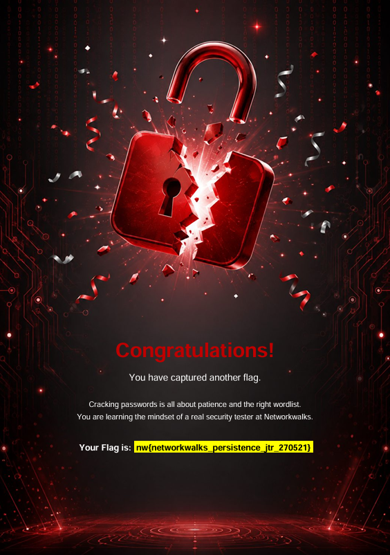

**Flag 3 (final confirmation):**

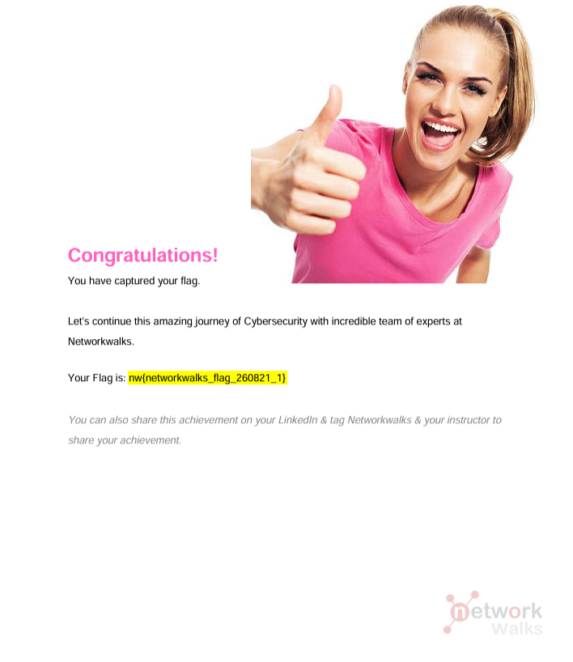

---

### Module 2 — Password Cracking with John the Ripper (W3-PM1)

#### Step 1 — Install Johnny GUI

Downloaded and installed Johnny (GUI front-end for John the Ripper) from the official Openwall website.

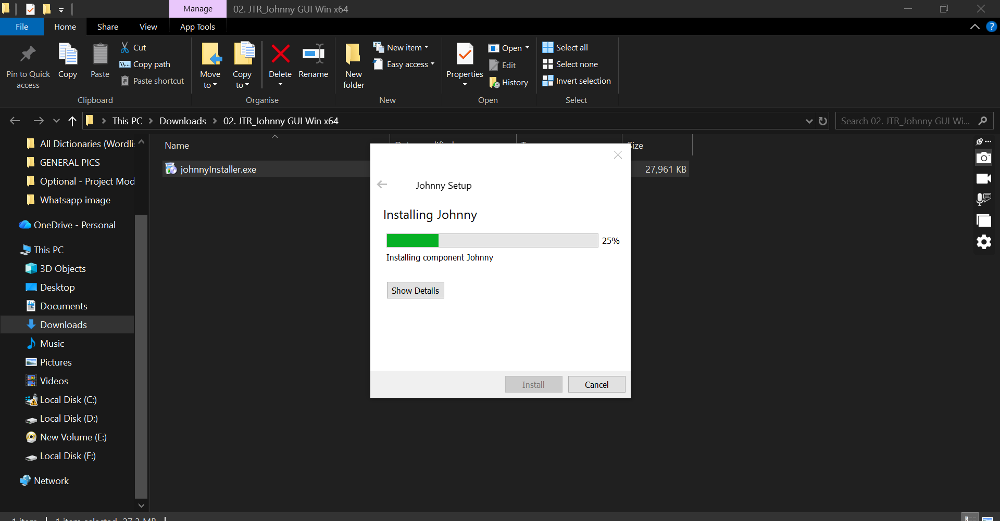

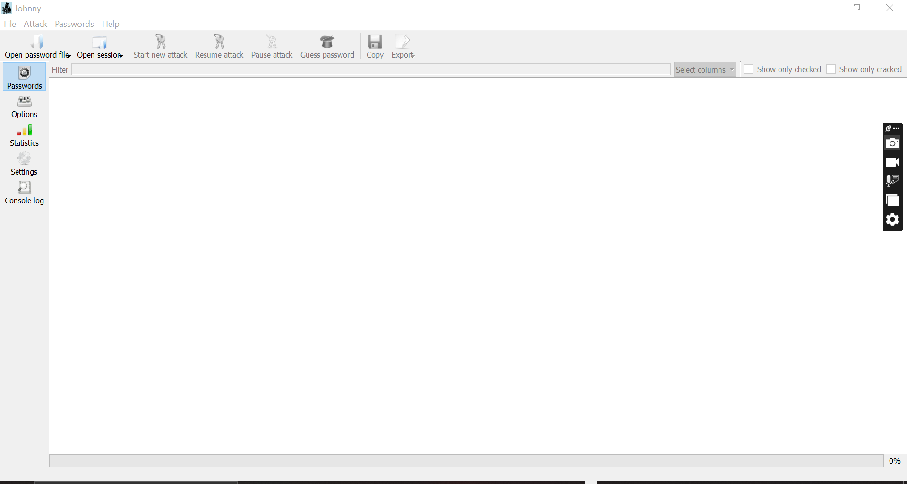

#### Step 2 — Extract the hash from the locked PDF

Used **OnlineHashCrack PDF Hash Extractor** to upload a locked PDF and extract the crackable hash.

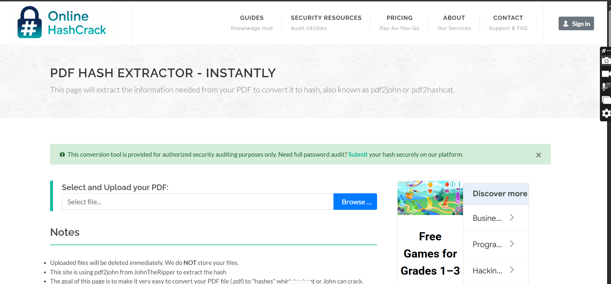

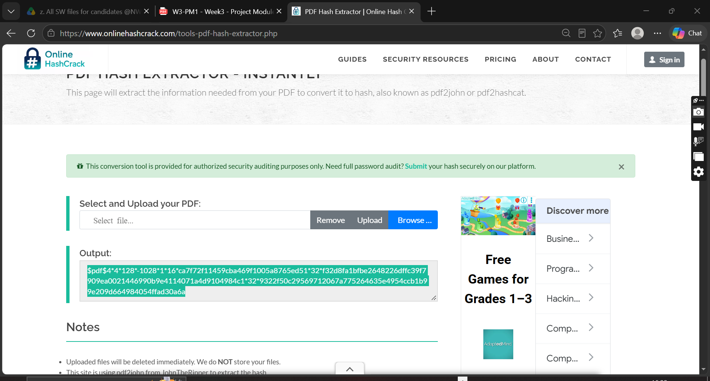

#### Step 3 — Save the hash to a file

Pasted the extracted hash into Notepad (removing the `b'` prefix if present, as per the lab instructions) and saved it as `hash1.txt`.

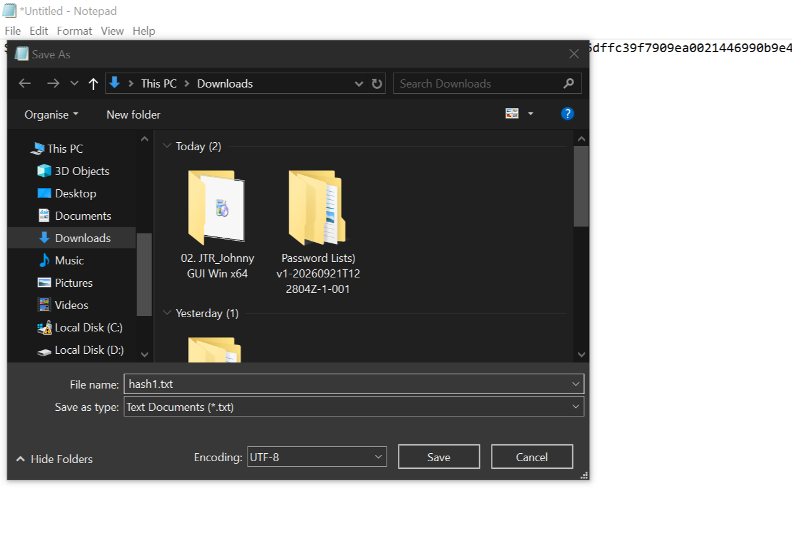

#### Step 4 — Load the hash into Johnny

Opened Johnny and used **Open password file** to load `hash1.txt`.

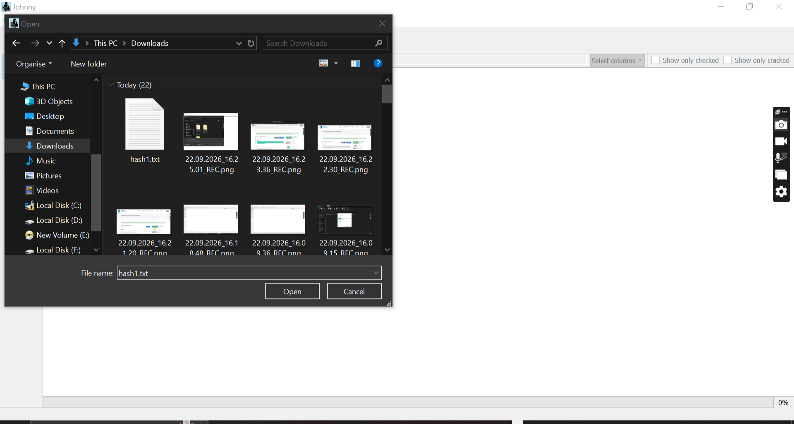

#### ⚠️ Troubleshooting — Johnny GUI failure

When attempting to start a new attack in Johnny on Windows, the following error appeared:

> *"Another johnnyInstaller instance is already running. Wait until it finishes, close it, or restart your system."*

This is a known Johnny GUI issue where the front-end loses its connection to the underlying `john.exe` process. Rather than continuing to troubleshoot the GUI, I moved the work to **Kali Linux**, where John the Ripper runs natively and reliably.

#### Step 5 — Crack with John the Ripper on Kali Linux

Copied `hash1.txt` into Kali (saved locally as `hash1.txt.save`), verified the hash with `cat`, and ran John the Ripper.

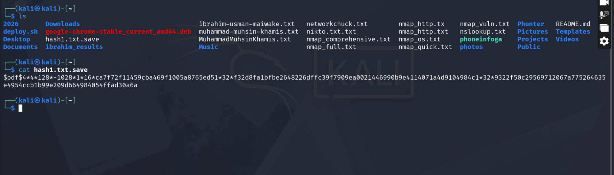

**Result:**
john --show hash1.txt.save
?:good-luck

1 password hash cracked, 0 left

text

Password successfully cracked: **`good-luck`**

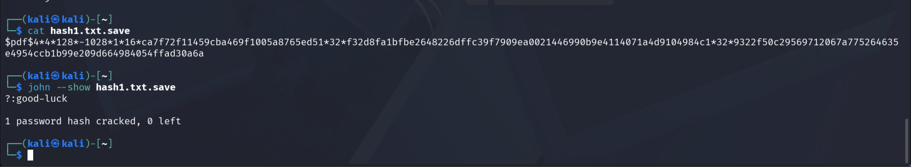

#### Step 6 — Unlock the PDF

Used the cracked password `good-luck` to open the protected PDF.

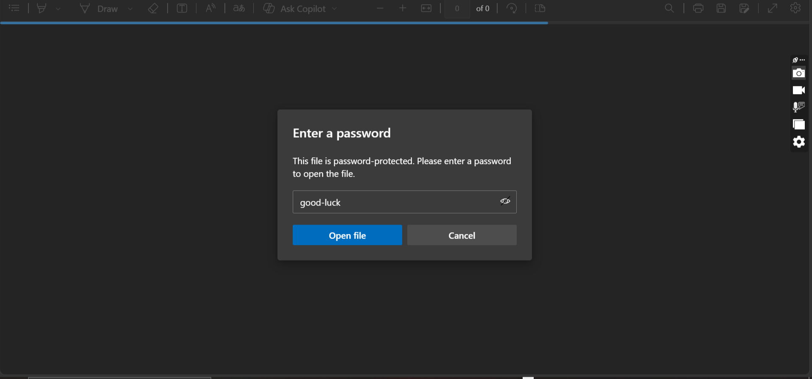

---

## 🐞 Problems Encountered & Solutions

### Problem 1. Johnny GUI — "Another johnnyInstaller instance is already running"

**Cause:** Johnny GUI on Windows lost its connection to the underlying `john.exe` process.

**Solution:** Rather than restarting Windows or fighting the GUI, the task was continued on **Kali Linux** using the `john` command directly. This was faster, cleaner, and produced the same result.

**Lesson learned:** Understanding the command-line tool behind a GUI is important — it gives you a fallback when the GUI breaks, and it's the more professional workflow for real security testing.

---

## 📊 Risk Analysis / Impact

| # | Risk / Finding | Evidence | Potential Impact | Risk Level |
|---|---|---|---|---|
| 1 | Weak password `good-luck` cracked in seconds | JTR + NW Cracker | Dictionary words offer no protection | High |
| 2 | Weak password `password1` cracked instantly | NW Cracker | Top-100 password, trivially guessable | High |
| 3 | Weak password `1qaz2wsx` cracked | NW Cracker | Keyboard-walk pattern, easily guessed | High |
| 4 | Offline hash extraction is straightforward | OnlineHashCrack + NW Hash Calculator | Anyone with the PDF can begin cracking | Medium |
| 5 | PDF encryption alone is not sufficient | All three PDFs unlocked | Encrypted PDFs need strong passwords | Medium |

**Risk Level Key:** Critical / High / Medium / Low

*These observations come from an authorised educational lab. No real-world systems were targeted.*

---

## 💡 Recommendations

1. Use **long passphrases** (12+ characters with mixed case, numbers, symbols).
2. Avoid **dictionary words** — even "clever" ones like `good-luck`.
3. Avoid **keyboard patterns** like `1qaz2wsx` — cracking tools specifically target these.
4. Use a **password manager** to generate and store strong passwords.
5. Enable **full-disk encryption** on devices holding sensitive files.
6. Remember: **encryption is only as strong as its password**.
7. Perform password-strength audits on encrypted files shared by your organisation.

---

## 💡 What I Learned

Through this project, I learned:

1. **How hashes work** — passwords are never stored in plaintext, even inside locked PDFs. They are stored as `$pdf$` hashes and can be extracted with tools like `pdf2john`.

2. **How dictionary attacks work** — both John the Ripper and the Networkwalks Cracker work by hashing each word in a wordlist and comparing the result against the target hash.

3. **The importance of CLI knowledge** — when the Johnny GUI failed, I was able to continue with the `john` command on Kali Linux. Understanding the underlying tool matters more than knowing the GUI.

4. **Weak passwords break encryption** — all three PDFs I cracked had weak, guessable passwords (`good-luck`, `password1`, `1qaz2wsx`). Encryption is only as strong as the password.

5. **Documenting problems is part of the project** — the Johnny error is now a section of this report, showing real troubleshooting.

---

## 🔐 Security & Ethical Use

This project was completed as part of an authorised educational lab at NetworkWalks. All activities were performed against **lab-provided encrypted PDF files** specifically supplied for this exercise.

No real-world systems, accounts, or user data were targeted. No unauthorised access or credential attacks on live systems were performed.

The techniques shown are for **defensive education** — understanding how password cracking works so stronger passwords and controls can be implemented.

---

## 👤 Author

**Muhammad Muhsin Khamis**  
Cybersecurity Student — Bayero University Kano (BUK)  
Cybersecurity Program B083C — NetworkWalks  
LinkedIn: [Muhammad Muhsin Khamis](https://www.linkedin.com/in/muhammad-muhsin-khamis-9860b3311/)

---

## 📌 Project Information

**Program Name:** Cybersecurity at NetworkWalks  
**Batch:** B083C  
**Week:** 03  
**Projects:** W3-PM1 (JTR) & W3-PM2 (NW Tools)  
**Repository:** [GitHub](https://github.com/MuhseenMK/NETWORKWALKS-B083C-WK3-PASSWORD-CRACKING-JTR-NWTOOLS)

---

**End of Report**
